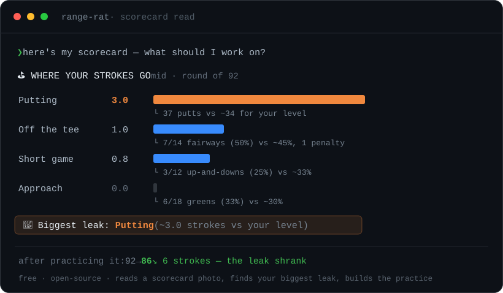

# 🏌️ rangey

<p align="center">
  <a href="LICENSE"></a>
  
  
  
</p>

> Show Claude your scorecard. It finds the strokes you're actually losing — and builds the practice to win them back.

<p align="center">
  
</p>

**rangey** is a free, open-source [Claude skill](https://www.anthropic.com/news/skills) that turns a photo of your scorecard into a **strokes-lost breakdown**, names your single biggest leak, and builds a **science-based practice session** to fix it — then tracks whether it worked.

No app to download. No subscription. It runs inside the Claude you already use.

---

## See it work

Show your card, or just rattle off the round. It doesn't eyeball it — it quantifies where your strokes went:

```text
⛳  WHERE YOUR STROKES GO   (mid baseline, round of 92)
   Putting       3.0  ██████████████████
                      └ 37 putts vs ~34 for your level
   Off the tee   1.0  ██████
                      └ 7/14 fairways (50%) vs ~45%, 1 penalty
   Short game    0.8  █████
                      └ 3/12 up-and-downs (25%) vs ~33%
   Approach      0.0
                      └ 6/18 greens (33%) vs ~30%

🎯  Biggest leak: Putting  (~3.0 strokes vs your level)
```

You *felt* like you were spraying drives. The data says your **putter** cost you three shots — so that's what you train next, not what feels good on the range.

Then it builds the session to fix exactly that:

```text
🎯 Focus: Putting — your last round bled ~3 strokes here.
🕒 Session (30 min, putting green):

  Warm-up — 5 min · feel
    Ladder drill: roll to 10 / 20 / 30 ft, no hole. Just speed.
  Distance control — 15 min · random
    Lag to a 3-ft circle from 9 random spots (15–50 ft). Never repeat.
  🔥 Pressure test — 10 min: make 10 from 4 ft, restart on a miss.
     Log the longest streak you finished on.
📈 Next time: beat it → move to 5 ft; stuck → narrow to make-7.
```

Practice it, play again, and re-run the read. The loop closes:

```text
2 rounds logged:
   2026-05-10   score 92   leak: Putting  — windy back 9
   2026-05-24   score 86   leak: Putting  — putting felt better

   score 92 → 86   ↘ lower (good)
```

The leak shrinks. The score follows.

---

## "Can't I just ask Claude for a practice plan?"

You can — and you'll get a generic, driver-heavy drill list, because that's what *feels* like practice. rangey is the prompt you don't know how to write: the motor-learning research baked in, and **your own round data** deciding what to work on. That last part is what a cold chat can't reproduce — it doesn't have your scorecard.

---

## Why it's not another practice app

The space is crowded and paywalled — CORE Golf, Break X, and others charge monthly for static drill libraries. By their own users' reviews, they share a blind spot: they don't understand how *you* play, and they don't evolve with your game.

rangey is the opposite, and it's **free and open-source**:

- **Starts from your data** — your scorecard, not a menu
- **Adaptive** — targets your specific leak and re-checks it every round
- **Built on the science** — blocked vs. random vs. pressure practice, applied properly (most golfers get this exactly backwards)
- **Closes the loop** — every session ends with a scored test you log, so the next one adjusts

---

## The science it bakes in

1. **Aim where strokes are actually lost.** For most amateurs that's approach + short game inside 100 yards — not driving (Mark Broadie's strokes-gained work). The skill resists the driver-bias.
2. **Block to learn, random to transfer.** Hitting the same shot 30 times feels great and transfers *poorly*. Changing target/club every rep feels worse and transfers far better — the course never gives you the same shot twice. Random practice does the heavy lifting.
3. **End with pressure, keep score.** Practice without consequences doesn't prepare you for the first tee. Every session finishes with a scored game that produces a number to track.
4. **Quality over quantity.** A sharp 45 minutes beats two aimless hours — and saves your body.

---

## Quickstart

1. Put the `rangey/` folder in your skills directory (or just open these files in Claude — works on Claude.ai, Claude Code, and the API).
2. Show Claude a photo of your scorecard, or tell it the round:
   > *"Shot 92 — 37 putts, hit 7 fairways and 6 greens, one penalty."*
3. It finds your leak and builds the session. Go practice.
4. Log the pressure-test score. Next round, re-run the read and watch the leak move.

Prefer the command line? The engine is plain Python 3, zero dependencies:

```bash
python scripts/round_log.py add --level mid --score 92 --putts 37 \
    --fir 7/14 --gir 6 --updowns 3/12 --penalties 1
python scripts/practice_log.py add --focus putting --score 7
```

---

## Install

```
your-skills-directory/
└── rangey/
    ├── SKILL.md
    ├── README.md
    └── scripts/
        ├── round_log.py      # scorecard → your biggest leak
        └── practice_log.py   # pressure-test scores → trend
```

---

## Honest about what it is

- It's practice **guidance**, not swing instruction or medical advice — it won't diagnose your mechanics from text.
- The strokes-lost read is a **transparent approximation** from round-level stats, not shot-by-shot strokes-gained (true SG needs a launch monitor or a shot tracker). It's built to find your *biggest* leak — which is all you need to aim one session — not to match a tour stat sheet.
- It favors quality over volume, partly because hammering hundreds of full-swing balls is how golfers get hurt.

---

## License

MIT — use it, fork it, build on it.

---

*If rangey finds a leak you didn't know you had, ⭐ it — that's what helps the next golfer find it.*
